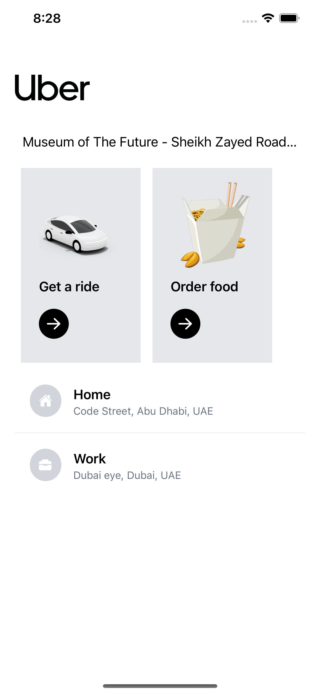
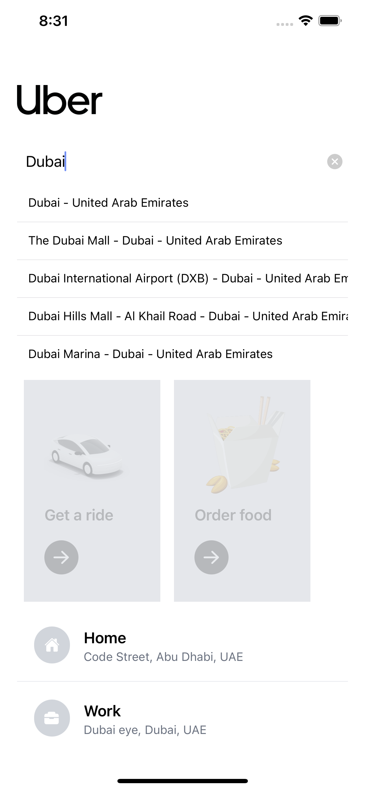
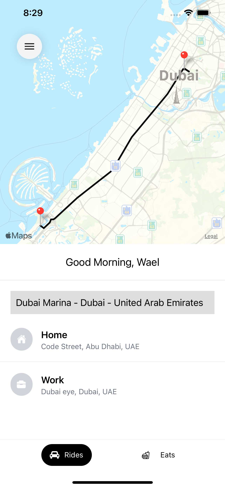
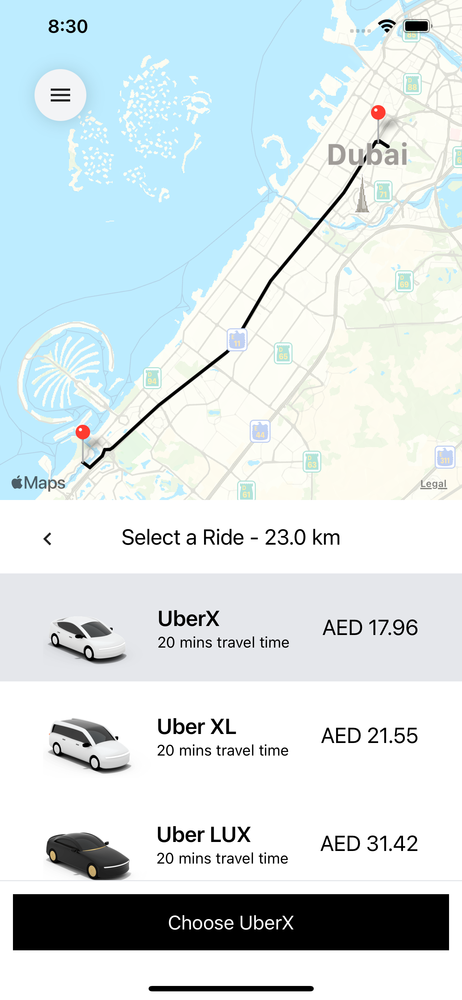

# uber

## React Native

React Native, Redux Toolkit, Google Maps, Google AutoComplete & Tailwind CSS

## Home Screen 

| Home |    | google auto complete |
| --- | -- | --- |
|  |  |  |

## Maps 

| Select destination |    | Select ride |
| --- | -- | --- |
|  |  |  |

Android 

IOS 